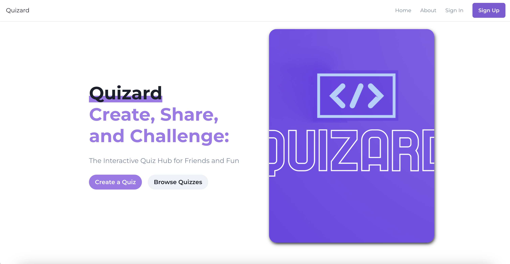

# Quizard: The Interactive Quiz Platform

Quizard is a web application that allows users to create custom quizzes, share them with friends, and challenge their knowledge in a fun and interactive way. Built with React, React Router, ChakraUI, and Python Flask, this platform offers an engaging and seamless user experience.
</img>
## Table of Contents
- [Features](#features)
- [Technologies Used](#technologies-used)
- [Installation](#installation)
- [Getting Started](#getting-started)

## Features
- &#9745; Create custom quizzes with multiple question types and varying difficulty levels.
- &#9745; Share quizzes with friends using unique links.
- &#x2610;Track progress and performance with user profiles and statistics.
- &#9745; Browse List of Quizzes to take
- &#x2610; Filter quizzes based on category
- &#9745; Responsive design for an optimized experience on different devices.
- &#9745; Rich and intuitive user interface built with ChakraUI.

## Technologies Used
- React: Frontend library for building user interfaces.
- React Router: Declarative routing for React applications.
- ChakraUI: A modular and accessible component library for React.
- Python Flask: A lightweight web framework for Python, used to build the backend API.
- Playwright: A JavaScript framework for Web Testing and Automation.

[Todo](TODO.md)

## Installation
To set up the project locally, follow these steps:

1. Clone the repository:
`git clone https://github.com/username/quizard.git`
2. Navigate to the project folder
3. Install dependencies for the frontend and backend:
`cd client`
`npm install`
`cd ../flask-server`
`pip install -r requirements.txt`

## Getting Started
1. Start the backend Flask server:
`cd flask-server`
`python server.py`

2. In a separate terminal, navigate to the frontend folder and start the React development server:
`cd client`
`npm start`

The application should now be running on `http://localhost:3000/`.

Happy quizzing!

